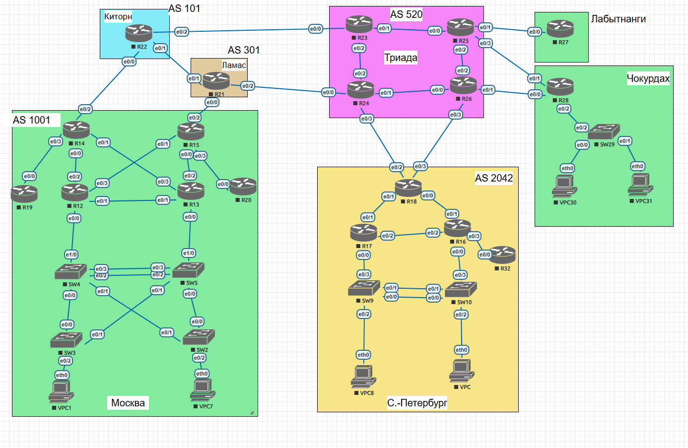

# Лабораторная работа №4. Проектирование сети
## Топология

## Задание
1. Разработать и задокументировать адресное пространство;
2. Настроить IP адреса на каждом активном порту;
3. Настроить каждый VPC в каждом офисе в своем VLAN;
4. Настроить VLAN/Loopbackup interface управления для сетевых устройств;
5. Настроите сети офисов так, чтобы не возникало broadcast штормов, а использование линков было максимально оптимизировано;
7. Использовать IPv4;
8. Задокументировать все изменения.

## Решение
### Выделил сети и vlan для филиалов:
Адрес сети  IpV4 |	маска |	префикс |	город |	Vlan |	Комментарий
---|---|---|---|---|---                    
192.168.0.0	| 255.255.0.0 |	16 | Москва | 8, 10-19	
172.16.20.0 |	255.255.252.0 |	22 |	СПБ	8, 20-29	
172.16.30.0 |	255.255.255.0 |	24 |	Триада		
172.16.40.0 |	255.255.255.0 |	24 |	Чокурдах |	8, 30-39	
172.16.50.0 |	255.255.255.0 |	24 |	Кигорн		
172.16.60.0 |	255.255.255.0 |	24 |	Ламас		
172.16.70.0 |	255.255.255.0 |	24 |	Лабытнаги		
10.0.0.0 |	255.255.0.0 |	16 |	сеть для стыков		

### VLANS
 № Vlan |	Vlan name |	Коментарий
---|---|---|
1 |	default |	Не используется
8 |	Management |	Для управления устройствами
10-90 |	VPC |	Для VPC
91-99 |	Reserve |	Зарезервировано
### Общая таблица		
Москва		
IPv4 адрес |	оборудование |	VLAN
---|---|---
192.168.10.0/24 |	сеть VPC1 |	10
192.168.10.1 |	Шлюз |	
192.168.10.2 |	R12 e0/0 |	
192.168.10.3 |	R12 e0/1 |	
192.168.10.4 |	R13 e0/0 |	
192.168.10.5 |	R13 e0/1 |	
192.168.10.6 |	VPC1	
192.168.10.7 |	SW3	
192.168.10.8 |	SW4	
192.168.11.0/24 |	сеть vpc7 |	11
192.168.11.1 |	Шлюз |	
192.168.11.2 |	R12 e0/0 |	
192.168.11.3 |	R12 e0/1 |	
192.168.11.4 |	R13 e0/0 |	
192.168.11.5 |	R13 e0/1 |	
192.168.11.6 |	VPC7 |	    
192.168.8.0/24 |	Management |	8
192.168.8.1 |	Шлюз	
192.168.8.2 |	SW2	
192.168.8.3 |	SW3	
192.168.8.4 |	SW4	
192.168.8.5 |	SW5	
192.168.8.6 |	R12	
192.168.8.7 |	R13	
192.168.8.8 |	R14	
192.168.8.9 |	R15	
192.168.8.10 |	R19	
192.168.8.11 |	R20	 
192.168.0.0/24 |	Стыки между маршрутизаторами	
192.168.0.1 |	R19 e0/0	
192.168.0.2 |	R14 e0/3	
192.168.0.3 |	R14 e0/0	
192.168.0.4 |	R12 e0/2	
192.168.0.5 |	R14 e0/1	
192.168.0.6 |	R13 e0/3	
192.168.0.7 |	R15 e0/1	
192.168.0.8 |	R12 e0/3	
192.168.0.9 |	R15 e0/0	
192.168.0.10 |	R13 e0/2	
192.168.0.11 |	R15 e0/3	
192.168.0.12 |	R20 e0/0	

Санкт-Петербург	
IPv4 адрес |	оборудование |	VLAN
---|---|---	
172.16.20.0/24 |	Сеть VPC |	20
172.16.20.1 |	Шлюз	
172.16.20.2 |	R17 e0/0	
172.16.20.3 |	R17 e0/2	
172.16.20.4 |	R16 e0/0	
172.16.20.5 |	R16 e0/2	
172.16.20.6 |	VPC8	        
172.16.21.0/24 |	Сеть VPC |	21
172.16.21.1 |	Шлюз	
172.16.21.2 |	R17 e0/0	
172.16.21.3 |	R17 e0/2	
172.16.21.4 |	R16 e0/0	
172.16.21.5 |	R16 e0/2	
172.16.21.6 |	VPC	 
172.16.22.0/24 |	Management |	8
172.16.22.1 |	Шлюз	
172.16.22.2 |	R16	
172.16.22.3 |	R17	
172.16.22.4 |	R18	
172.16.22.5 |	R32	
172.16.22.6 |	SW9	
172.16.22.7 |	SW10	      
172.16.23.0/24 |	Стыки межlу маршрутизатароми	
172.16.23.1 |	R18 e0/1	
172.16.23.2 |	R17 e0/1	
172.16.23.3 |	R18 e0/0	
172.16.23.4 |	R16 e0/1	
172.16.23.5 |	R16 e0/3	
172.16.23.6 |	R32 e0/0	

Чокурдах
IPv4 адрес |	оборудование |	VLAN
---|---|---			
172.16.40.0/28 |	Сеть VPC 30 |	40
172.16.40.1 |	Шлюз (R28 e0/0)	
172.16.40.2 |	VPC30	       
172.16.40.16/28 |	Сеть VPC31 |	41
172.16.40.17 |	Шлюз (R28 e0/0)	
172.16.40.18 |	VPC31	
172.16.40.32/28 |	Management |	8
172.16.40.33 |	Шлюз	
172.16.40.34 |	R28	
172.16.40.35 |	SW29	
        
Связь между роутерами 	
IPv4 адрес |	оборудование |	VLAN
---|---|---		
10.0.0.0.24 |	Стыки между узлами	
10.0.0.1 |	R22 e0/0	
10.0.0.2 |	R14 e0/2	
10.0.0.3 |	R22 e0/1	
10.0.0.4 |	R21 e0/1	
10.0.0.5 |	R22 e0/2	
10.0.0.6 |	R23 e0/0	
10.0.0.7 |	R21 e0/0	
10.0.0.8 |	R15 e0/2	
10.0.0.9 |	R21 e0/2	
10.0.0.10 |	R24 e0/0	
10.0.0.11 |	R24 e0/3	
10.0.0.12 |	R18 e0/2	
10.0.0.13 |	R26 e0/3	
10.0.0.14 |	R18 e0/3	
10.0.0.15 |	R25 e0/1	
10.0.0.16 |	R27 e0/0	
10.0.0.17 |	R25 e0/3	
10.0.0.18 |	R28 e0/1	
10.0.0.19 |	R26 e0/1	
10.0.0.20 |	R28 e0/0	

### Примеры настроек 
```
SW3#conf t
Enter configuration commands, one per line.  End with CNTL/Z.
SW3(config)#int e0/2
SW3(config-if)#switchport mode access
SW3(config-if)#switchport access vlan 10
% Access VLAN does not exist. Creating vlan 10
SW3(config-if)#exit
SW3(config)#int range e0/0-1
SW3(config-if-range)#switchport trunk encapsulation dot1q
SW3(config-if-range)#sw mo tr
SW3(config-if-range)#
*May  8 19:10:04.008: %LINEPROTO-5-UPDOWN: Line protocol on Interface Ethernet0/1, changed state to down
SW3(config-if-range)#
*May  8 19:10:07.006: %LINEPROTO-5-UPDOWN: Line protocol on Interface Ethernet0/1, changed state to up
SW3(config-if-range)#sw tr all vl 8,10,11
SW3(config-if-range)#ex
SW3(config)#vl 8
SW3(config-vlan)#name MNGMNT
SW3(config-vlan)#vlan 10
SW3(config-vlan)#name VPC1 netw
SW3(config-vlan)#vlan 11
SW3(config-vlan)#name VPC7 netw
SW3(config-vlan)#ex
SW3(config)#interface vlan 8
SW3(config-if)#
*May  8 19:12:01.854: %LINEPROTO-5-UPDOWN: Line protocol on Interface Vlan8, changed state to down
SW3(config-if)#ip address 192.168.8.3 255.255.255.0
SW3(config-if)#no shutdown
SW3(config-if)#
*May  8 19:13:10.745: %LINK-3-UPDOWN: Interface Vlan8, changed state to up
SW3(config-if)#
*May  8 19:13:11.749: %LINEPROTO-5-UPDOWN: Line protocol on Interface Vlan8, changed state to up
SW3(config)#ip default-gateway 192.168.8.1
```
```
SW4#conf t
Enter configuration commands, one per line.  End with CNTL/Z.
SW4(config)#int e0/0
SW4(config-if)#sw mo tr
Command rejected: An interface whose trunk encapsulation is "Auto" can not be configured to "trunk" mode.
SW4(config-if)#switchport trunk encapsulation dot1q
SW4(config-if)#sw mo tr
SW4(config-if)#sw tr all vl 8,10,11
SW4(config-if)#ex
SW4(config)#int e1/0
SW4(config-if)#switchport trunk encapsulation dot1q
SW4(config-if)#sw mo tr
SW4(config-if)#
*May  8 19:18:42.227: %LINEPROTO-5-UPDOWN: Line protocol on Interface Ethernet1/0, changed state to down
SW4(config-if)#
*May  8 19:18:45.235: %LINEPROTO-5-UPDOWN: Line protocol on Interface Ethernet1/0, changed state to up
SW4(config-if)#sw tr all vl 8,10,11
SW4(config-if)#ex
SW4(config)#vl 8
SW4(config-vlan)#name MNGMNT
SW4(config-vlan)#vlan 10
SW4(config-vlan)#name VPC1 netw
SW4(config-vlan)#vlan 11
SW4(config-vlan)#name VPC7 netw
SW4(config-vlan)#ex
SW4(config)#interface vlan 8
SW4(config-if)#
*May  8 19:19:37.673: %LINEPROTO-5-UPDOWN: Line protocol on Interface Vlan8, changed state to down
SW4(config-if)#ip address 192.168.8.4 255.255.255.0
SW4(config-if)#no shutdown
SW4(config-if)#
*May  8 19:20:13.699: %LINK-3-UPDOWN: Interface Vlan8, changed state to up
*May  8 19:20:14.699: %LINEPROTO-5-UPDOWN: Line protocol on Interface Vlan8, changed state to up
SW4(config-if)#
```

```
R12#conf t
Enter configuration commands, one per line.  End with CNTL/Z.
R12(config)#int e0/0.8
R12(config-subif)#encapsulation dot1Q 8
R12(config-subif)#ip address 192.168.8.6 255.255.255.0
R12(config-subif)#description MNGMNT
R12(config-subif)#int e0/0.10
R12(config-subif)#encapsulation dot1Q 10
R12(config-subif)#ip address 192.168.10.1 255.255.255.0
R12(config-subif)#description VPC10_netw
R12(config-subif)#int e0/0.11
R12(config-subif)#encapsulation dot1Q 11
R12(config-subif)#ip address 192.168.11.1 255.255.255.0
R12(config-subif)#description VPC11_netw
R12(config-subif)#exit
R12(config)#exit
```
Проверка
```
VPCS> ping 192.168.10.1

192.168.10.1 icmp_seq=1 timeout
84 bytes from 192.168.10.1 icmp_seq=2 ttl=255 time=2.142 ms
84 bytes from 192.168.10.1 icmp_seq=3 ttl=255 time=1.838 ms
84 bytes from 192.168.10.1 icmp_seq=4 ttl=255 time=1.839 ms
84 bytes from 192.168.10.1 icmp_seq=5 ttl=255 time=1.495 ms

```