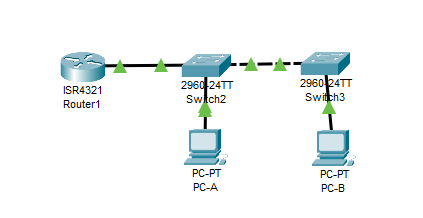

# Лабораторная работа №1. Внедрение маршрутизации между виртуальными локальными сетями
## Топология:

## Таблица адресации
Device | Interface | IP Address | Subnet Mask | Default Gateway
--- | --- | --- | --- | ---
R1 | G0/0/1.3 | 192.168.3.1 | 255.255.255.0 | N/A
R1 | G0/0/1.4 | 192.168.4.1 | 255.255.255.0 | N/A
R1 | G0/0/1.8 | N/A | N/A | N/A
S1 | VLAN 3 | 192.168.3.11 | 255.255.255.0 | 192.168.3.1
S2 | VLAN 3 | 192.168.3.12 | 255.255.255.0 | 192.168.3.1
PC-A | NIC | 192.168.3.3 | 255.255.255.0 | 192.168.3.1
PC-B | NIC | 192.168.4.3 | 255.255.255.0 | 192.168.4.1

## Таблица Vlan
VLAN | Name | Interface Assigned
--- | --- | --- 
3 | Management | S1: VLAN 3
 | | |S2: VLAN 3
 | | | S1: F0/6
4 | Operations | S2: F0/18
7 |  ParkingLot |S1: F0/2-4, F0/7-24, G0/1-2
 | | |S2: F0/2-17, F0/19-24, G0/1-2
8 | Native | N/A
## Задание

Часть 1. Создание сети и настройка основных параметров устройства
Часть 2. Создание сетей VLAN и назначение портов коммутатора
Часть 3. Настройка транка 802.1Q между коммутаторами
Часть 4. Настройка маршрутизации между VLAN на маршрутизаторе
Часть 5. Убедитесь, что маршрутизация между VLAN работает

## Решение
Файл .pkt с настроенным оборудованием лежит по [ссылке](https://github.com/EToLLa/otus_network_engineer/blob/main/Lab1/lab1.pkt) 
### Часть 1 Создание сети и настройка основных параметров устройства
Подключил оборудование согласно схеме выполнил первоначальную настройку 
На примере роутера:
```
enable
conf t
hostname R1
no ip domain-lookup
password class
line console 0
password cisco
login
exit
line vty 0 15
password cisco
login
exit
service password-encryption
banner motd #Unauthorized access to this device is prohibited!#
copy running-config startup-config 
clock set
```
Прописал компьютерам заданные ip адреса

### Часть 2 Создание сетей VLAN и назначение портов коммутатора
1. Создал необходимые вланы на свитчах ( на примере одного свитча)
```
vlan 3
name Management
exit

vlan 4
name Operations
exit

vlan 7
name ParkingLot
exit

vlan 8
name Native
exit

S1(config)#int vlan 3
S1(config-if)#ip address 192.168.3.11 255.255.255.0
S1(config-if)#no shutdown
S1(config-if)#exit
S1(config)#ip default-gateway 192.168.3.1
```
2. Включил порты в необходимые vlan на примере SW1
```
int  fastEthernet 0/6 
S1(config-if)#sw mode ac
S1(config-if)#sw acc vl 3
S1(config-if-range)#exit

int range fastEthernet 0/2 - 4, fastEthernet 0/7 - 24, gigabitEthernet 0/1 - 2
S1(config-if-range)#sw mode ac
S1(config-if-range)#sw acc vl 7
S1(config-if-range)#shutdown
S1(config-if-range)#exit
```

3. Show vlan brief
SW1
```
VLAN Name                             Status    Ports
---- -------------------------------- --------- -------------------------------
1    default                          active    
3    Management                       active    Fa0/6
4    Operations                       active    
7    ParkingLot                       active    Fa0/2, Fa0/3, Fa0/4, Fa0/7
                                                Fa0/8, Fa0/9, Fa0/10, Fa0/11
                                                Fa0/12, Fa0/13, Fa0/14, Fa0/15
                                                Fa0/16, Fa0/17, Fa0/18, Fa0/19
                                                Fa0/20, Fa0/21, Fa0/22, Fa0/23
                                                Fa0/24, Gig0/1, Gig0/2
```
SW2
```
VLAN Name                             Status    Ports
---- -------------------------------- --------- -------------------------------
1    default                          active    
3    Management                       active    
4    Operations                       active    Fa0/18
7    ParkingLot                       active    Fa0/2, Fa0/3, Fa0/4, Fa0/5
                                                Fa0/6, Fa0/7, Fa0/8, Fa0/9
                                                Fa0/10, Fa0/11, Fa0/12, Fa0/13
                                                Fa0/14, Fa0/15, Fa0/16, Fa0/17
                                                Fa0/19, Fa0/20, Fa0/21, Fa0/22
                                                Fa0/23, Fa0/24, Gig0/1, Gig0/2
```
### Часть 3 Настройка транка 802.1Q между коммутаторами
1. Скофигурировал транк на sw1 порт f0/1
```
S1(config)#int f0/1
S1(config-if)#sw mode trunk
S1(config-if)#sw tr native vlan 8
S1(config-if)#sw tr all vlan 3,4,8
```
2. Аналогично сконфигурировал порт f0/5
show interfaces trunk
```
Port        Mode         Encapsulation  Status        Native vlan
Fa0/1       on           802.1q         trunking      8
Fa0/5       on           802.1q         trunking      8

Port        Vlans allowed on trunk
Fa0/1       3-4,8
Fa0/5       3-4,8

Port        Vlans allowed and active in management domain
Fa0/1       3,4,8
Fa0/5       3,4,8

Port        Vlans in spanning tree forwarding state and not pruned
Fa0/1       3,4,8
Fa0/5       3,4,8
```  
### Часть 4 Настройка маршрутизации между VLAN на маршрутизаторе
Настроил интерфейсы и влан на роутере
```
int f0/0/1
no shutdown
R1(config)#int g0/0/1.3
R1(config-subif)#encapsulation dot1q 3
R1(config-subif)#ip addr 192.168.3.1 255.255.255.0
R1(config-subif)#int g0/0/1.4
R1(config-subif)#encapsulation dot1q 4
R1(config-subif)#ip addr 192.168.4.1 255.255.255.0
R1(config-subif)#int g0/0/1.8
R1(config-subif)#encapsulation dot1Q 8 native 
```
show ip interfaces brief
```
Interface              IP-Address      OK? Method Status                Protocol 
GigabitEthernet0/0/0   unassigned      YES unset  administratively down down 
GigabitEthernet0/0/1   unassigned      YES unset  up                    up 
GigabitEthernet0/0/1.3 192.168.3.1     YES manual up                    up 
GigabitEthernet0/0/1.4 192.168.4.1     YES manual up                    up 
GigabitEthernet0/0/1.8 unassigned      YES unset  up                    up 
Vlan1                  unassigned      YES unset  administratively down down
```
### Часть 5 Убедитесь, что маршрутизация между VLAN работает
1. Выполните следующие тесты с PC-A
а. Пинг с PC-A на шлюз
```
C:\>ping 192.168.3.1

Pinging 192.168.3.1 with 32 bytes of data:

Reply from 192.168.3.1: bytes=32 time<1ms TTL=255
Reply from 192.168.3.1: bytes=32 time<1ms TTL=255
Reply from 192.168.3.1: bytes=32 time<1ms TTL=255
Reply from 192.168.3.1: bytes=32 time<1ms TTL=255

Ping statistics for 192.168.3.1:
    Packets: Sent = 4, Received = 4, Lost = 0 (0% loss),
Approximate round trip times in milli-seconds:
    Minimum = 0ms, Maximum = 0ms, Average = 0ms
```
б. Пинг с PC-A на PC-B
```
C:\>ping 192.168.4.3

Pinging 192.168.4.3 with 32 bytes of data:

Request timed out.
Reply from 192.168.4.3: bytes=32 time<1ms TTL=127
Reply from 192.168.4.3: bytes=32 time<1ms TTL=127
Reply from 192.168.4.3: bytes=32 time<1ms TTL=127

Ping statistics for 192.168.4.3:
    Packets: Sent = 4, Received = 3, Lost = 1 (25% loss),
Approximate round trip times in milli-seconds:
    Minimum = 0ms, Maximum = 0ms, Average = 0ms
```
в. Пинг с PC-A на SW2
```
C:\>ping 192.168.3.12

Pinging 192.168.3.12 with 32 bytes of data:

Request timed out.
Reply from 192.168.3.12: bytes=32 time<1ms TTL=255
Reply from 192.168.3.12: bytes=32 time<1ms TTL=255
Reply from 192.168.3.12: bytes=32 time<1ms TTL=255

Ping statistics for 192.168.3.12:
    Packets: Sent = 4, Received = 3, Lost = 1 (25% loss),
Approximate round trip times in milli-seconds:
    Minimum = 0ms, Maximum = 0ms, Average = 0ms
```
2. C PC-B запустите traceroute до PC-A
```
C:\>tracert 192.168.3.3

Tracing route to 192.168.3.3 over a maximum of 30 hops: 

  1   0 ms      0 ms      0 ms      192.168.4.1
  2   0 ms      0 ms      0 ms      192.168.3.3

Trace complete.
```
В результате мы видим только адрес нашего роутера и адрес компьютера.