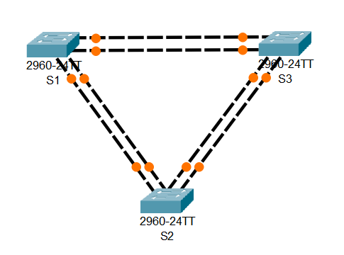
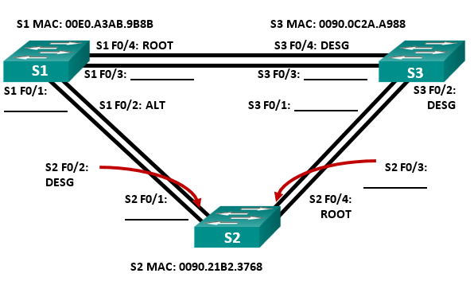

# Лабораторная работа №2. Развертывание коммутируемой сети с резервными каналами
## Топология:

##
	Таблица адресации

Устройство | Интерфейс | IP-адрес |Маска подсети
--- | --- | --- | ---
S1 | VLAN 1 | 192.168.1.1 | 255.255.255.0
S2 | VLAN 1 | 192.168.1.2 | 255.255.255.0
S3 | VLAN 1 | 192.168.1.3 | 255.255.255.0
## 	Цели
Часть 1. Создание сети и настройка основных параметров устройства
Часть 2. Выбор корневого моста
Часть 3. Наблюдение за процессом выбора протоколом STP порта, исходя из стоимости портов
Часть 4. Наблюдение за процессом выбора протоколом STP порта, исходя из приоритета портов
## Решение
Файл .pkt с настроенным оборудованием:
## Часть 1.	Создание сети и настройка основных параметров устройства.
### Шаг 1. Подключение устройств согласно топологии.
Покдлючил устройства согласно топологии
### Шаг 2 - Шаг 3. Инициализация и настройка коммутаторов.
Выполнил инициализацию и настройку коммутаторов, на примере одного из коммутаторов:
```
Switch>enable
Switch#conf t
Enter configuration commands, one per line.  End with CNTL/Z.
Switch(config)#hostname S1
S1(config)#no ip domain-lookup
S1(config)#enable secret class
S1(config)#line console 0
S1(config-line)#password cisco
S1(config-line)#login
S1(config-line)#logging synchronous
S1(config-line)#exit
S1(config)#line vty 0 15
S1(config-line)#password cisco
S1(config-line)#login
S1(config-line)#exit
S1(config)#service password-encryption
S1(config)#banner motd #Unauthorized access to this device is prohibited!#
exit
S1(config)#clock set 19:47 Mar 5 2025
S1(config)#int vlan 1
S1(config-if)#ip address 192.168.1.1 255.255.255.0
S1(config-if)#no shutdown
S1(config-if)#
%LINK-5-CHANGED: Interface Vlan1, changed state to up
%LINEPROTO-5-UPDOWN: Line protocol on Interface Vlan1, changed state to up
S1(config-if)#exit
copy running-config startup-config 
```
### Шаг 4. Проверьте связь.
Проверил связь между коммутаторами:
```
S1>ping 192.168.1.2

Type escape sequence to abort.
Sending 5, 100-byte ICMP Echos to 192.168.1.2, timeout is 2 seconds:
..!!!
Success rate is 60 percent (3/5), round-trip min/avg/max = 0/0/0 ms

S1>ping 192.168.1.3

Type escape sequence to abort.
Sending 5, 100-byte ICMP Echos to 192.168.1.3, timeout is 2 seconds:
..!!!
Success rate is 60 percent (3/5), round-trip min/avg/max = 0/0/0 ms

S2>ping 192.168.1.1

Type escape sequence to abort.
Sending 5, 100-byte ICMP Echos to 192.168.1.1, timeout is 2 seconds:
!!!!!
Success rate is 100 percent (5/5), round-trip min/avg/max = 0/0/0 ms

S2>ping 192.168.1.3

Type escape sequence to abort.
Sending 5, 100-byte ICMP Echos to 192.168.1.3, timeout is 2 seconds:
..!!!
Success rate is 60 percent (3/5), round-trip min/avg/max = 0/0/0 ms

S3>ping 192.168.1.1

Type escape sequence to abort.
Sending 5, 100-byte ICMP Echos to 192.168.1.1, timeout is 2 seconds:
!!!!!
Success rate is 100 percent (5/5), round-trip min/avg/max = 0/0/0 ms

S3>ping 192.168.1.2

Type escape sequence to abort.
Sending 5, 100-byte ICMP Echos to 192.168.1.2, timeout is 2 seconds:
!!!!!
Success rate is 100 percent (5/5), round-trip min/avg/max = 0/0/0 ms
```
## Часть 2. Определение корневого моста
### Шаг 1. Отключение портов на коммутаторах.
Отключил все порты на коммутаторах
```
S1(config)#int range fa0/1-4
S1(config-if-range)#shutdown 
```
### Шаг 2. Настроить подключенные порты в качестве транковых.
Настроил подключенные порты в качестве транковых:
```
S1(config-if-range)#sw mode trunk 
S1(config-if-range)#sw trunk allowed vlan 1
S1(config-if-range)#exit
```
### Шаг 3. Включить порты F0/2 и F0/4 на всех коммутаторах.
Включил соответсвующие порты.
### Шаг 4. Отобразить данные протокола spanning-tree
Данные протокола:
```
S1#show spanning-tree 
VLAN0001
  Spanning tree enabled protocol ieee
  Root ID    Priority    32769
             Address     0090.0C2A.A988
             Cost        19
             Port        4(FastEthernet0/4)
             Hello Time  2 sec  Max Age 20 sec  Forward Delay 15 sec

  Bridge ID  Priority    32769  (priority 32768 sys-id-ext 1)
             Address     00E0.A3AB.9B8B
             Hello Time  2 sec  Max Age 20 sec  Forward Delay 15 sec
             Aging Time  20

Interface        Role Sts Cost      Prio.Nbr Type
---------------- ---- --- --------- -------- --------------------------------
Fa0/2            Altn BLK 19        128.2    P2p
Fa0/4            Root FWD 19        128.4    P2p

S2#show spanning-tree 
VLAN0001
  Spanning tree enabled protocol ieee
  Root ID    Priority    32769
             Address     0090.0C2A.A988
             Cost        19
             Port        4(FastEthernet0/4)
             Hello Time  2 sec  Max Age 20 sec  Forward Delay 15 sec

  Bridge ID  Priority    32769  (priority 32768 sys-id-ext 1)
             Address     0090.21B2.3768
             Hello Time  2 sec  Max Age 20 sec  Forward Delay 15 sec
             Aging Time  20

Interface        Role Sts Cost      Prio.Nbr Type
---------------- ---- --- --------- -------- --------------------------------
Fa0/4            Root FWD 19        128.4    P2p
Fa0/2            Desg FWD 19        128.2    P2p

S3#show spanning-tree 
VLAN0001
  Spanning tree enabled protocol ieee
  Root ID    Priority    32769
             Address     0090.0C2A.A988
             This bridge is the root
             Hello Time  2 sec  Max Age 20 sec  Forward Delay 15 sec

  Bridge ID  Priority    32769  (priority 32768 sys-id-ext 1)
             Address     0090.0C2A.A988
             Hello Time  2 sec  Max Age 20 sec  Forward Delay 15 sec
             Aging Time  20

Interface        Role Sts Cost      Prio.Nbr Type
---------------- ---- --- --------- -------- --------------------------------
Fa0/4            Desg FWD 19        128.4    P2p
Fa0/2            Desg FWD 19        128.2    P2p
```
Так как все три коммутатора имеют равные значения приоритета идентификатора моста, выбор корневого моста был исходя из наименьшего MAC-адреса. Вмоем случае это коммутатор S3:

С учетом выходных данных, поступающих с коммутаторов, ответьте на следующие вопросы:
Какой коммутатор является корневым мостом? **S3**
Почему этот коммутатор был выбран протоколом spanning-tree в качестве корневого моста? **Из-за наименьшего мак адреса**
Какие порты на коммутаторе являются корневыми портами? **Те порты, которые смотрят в сторону корневого моста, т.к. эти порты обладают наименьшей стоимостью для его достижения  s1 f4 s2 f4**
Какие порты на коммутаторе являются назначенными портами? **Порты, используемые для восстановления связи с корневым мостом**
Какой порт отображается в качестве альтернативного и в настоящее время заблокирован? **S1 f2**
Почему протокол spanning-tree выбрал этот порт в качестве невыделенного (заблокированного) порта? **Сначала сравнивается стоимость пути до корневого моста. Для этой пары портов стоимость одинакова. По этой причине сравниваются BID коммутаторов. Видим что BID коммутатора S1 меньше BID коммутатора S2**
## Часть 3.Наблюдение за процессом выбора протоколом STP порта, исходя из стоимости портов.
### Шаг 1. Определить коммутатор с заблокированным портом.
В иоем случае это S1:
```
S1#show spanning-tree 
VLAN0001
  Spanning tree enabled protocol ieee
  Root ID    Priority    32769
             Address     0090.0C2A.A988
             Cost        19
             Port        4(FastEthernet0/4)
             Hello Time  2 sec  Max Age 20 sec  Forward Delay 15 sec

  Bridge ID  Priority    32769  (priority 32768 sys-id-ext 1)
             Address     00E0.A3AB.9B8B
             Hello Time  2 sec  Max Age 20 sec  Forward Delay 15 sec
             Aging Time  20

Interface        Role Sts Cost      Prio.Nbr Type
---------------- ---- --- --------- -------- --------------------------------
Fa0/2            Altn BLK 19        128.2    P2p
Fa0/4            Root FWD 19        128.4    P2p
```
### Шаг 2. Изменить стоимость порта.
Изменил стоимость другог опорта на этом коммутаторе:
```
interface f0/4
spanning-tree cost 18
```
### Шаг 3. Просмотреть изменение протокола spanning-tree.
Проверил изменение протокола:
```
S1#show spanning-tree 
VLAN0001
  Spanning tree enabled protocol ieee
  Root ID    Priority    32769
             Address     0090.0C2A.A988
             Cost        18
             Port        4(FastEthernet0/4)
             Hello Time  2 sec  Max Age 20 sec  Forward Delay 15 sec

  Bridge ID  Priority    32769  (priority 32768 sys-id-ext 1)
             Address     00E0.A3AB.9B8B
             Hello Time  2 sec  Max Age 20 sec  Forward Delay 15 sec
             Aging Time  20

Interface        Role Sts Cost      Prio.Nbr Type
---------------- ---- --- --------- -------- --------------------------------
Fa0/2            Desg FWD 19        128.2    P2p
Fa0/4            Root FWD 18        128.4    P2p

S2#show spanning-tree 
VLAN0001
  Spanning tree enabled protocol ieee
  Root ID    Priority    32769
             Address     0090.0C2A.A988
             Cost        19
             Port        4(FastEthernet0/4)
             Hello Time  2 sec  Max Age 20 sec  Forward Delay 15 sec

  Bridge ID  Priority    32769  (priority 32768 sys-id-ext 1)
             Address     0090.21B2.3768
             Hello Time  2 sec  Max Age 20 sec  Forward Delay 15 sec
             Aging Time  20

Interface        Role Sts Cost      Prio.Nbr Type
---------------- ---- --- --------- -------- --------------------------------
Fa0/4            Root FWD 19        128.4    P2p
Fa0/2            Altn BLK 19        128.2    P2p
```
Почему протокол spanning-tree заменяет ранее заблокированный порт на назначенный порт и блокирует порт, который был назначенным портом на другом коммутаторе? **По той причине, что протокол сначала сравнивает стоимость пути до корневого моста. А мы вручную её уменьшили.**
### Шаг 4. Удалить изменение стоимости порта.
Удалил стоимость порта:
```
interface f0/4
no spanning-tree vlan 1 cost 18
```
Проверил настройки протокола:
```
S1#show spanning-tree 
VLAN0001
  Spanning tree enabled protocol ieee
  Root ID    Priority    32769
             Address     0090.0C2A.A988
             Cost        19
             Port        4(FastEthernet0/4)
             Hello Time  2 sec  Max Age 20 sec  Forward Delay 15 sec

  Bridge ID  Priority    32769  (priority 32768 sys-id-ext 1)
             Address     00E0.A3AB.9B8B
             Hello Time  2 sec  Max Age 20 sec  Forward Delay 15 sec
             Aging Time  20

Interface        Role Sts Cost      Prio.Nbr Type
---------------- ---- --- --------- -------- --------------------------------
Fa0/2            Altn BLK 19        128.2    P2p
Fa0/4            Root FWD 19        128.4    P2p
```
## Часть 4. Наблюдение за процессом выбора протоколом STP порта, исходя из приоритета портов.
Включил порты F0/1 и F0/3 на всех коммутаторах.
Проверил работу протокола spanning-tree на коммутаторах:
```
S1#show spanning-tree 
VLAN0001
  Spanning tree enabled protocol ieee
  Root ID    Priority    32769
             Address     0090.0C2A.A988
             Cost        19
             Port        3(FastEthernet0/3)
             Hello Time  2 sec  Max Age 20 sec  Forward Delay 15 sec

  Bridge ID  Priority    32769  (priority 32768 sys-id-ext 1)
             Address     00E0.A3AB.9B8B
             Hello Time  2 sec  Max Age 20 sec  Forward Delay 15 sec
             Aging Time  20

Interface        Role Sts Cost      Prio.Nbr Type
---------------- ---- --- --------- -------- --------------------------------
Fa0/1            Altn BLK 19        128.1    P2p
Fa0/2            Altn BLK 19        128.2    P2p
Fa0/3            Root FWD 19        128.3    P2p
Fa0/4            Altn BLK 19        128.4    P2p

S2#show spanning-tree 
VLAN0001
  Spanning tree enabled protocol ieee
  Root ID    Priority    32769
             Address     0090.0C2A.A988
             Cost        19
             Port        3(FastEthernet0/3)
             Hello Time  2 sec  Max Age 20 sec  Forward Delay 15 sec

  Bridge ID  Priority    32769  (priority 32768 sys-id-ext 1)
             Address     0090.21B2.3768
             Hello Time  2 sec  Max Age 20 sec  Forward Delay 15 sec
             Aging Time  20

Interface        Role Sts Cost      Prio.Nbr Type
---------------- ---- --- --------- -------- --------------------------------
Fa0/1            Desg FWD 19        128.1    P2p
Fa0/3            Root FWD 19        128.3    P2p
Fa0/4            Altn BLK 19        128.4    P2p
Fa0/2            Desg FWD 19        128.2    P2p

S3#show spanning-tree 
VLAN0001
  Spanning tree enabled protocol ieee
  Root ID    Priority    32769
             Address     0090.0C2A.A988
             This bridge is the root
             Hello Time  2 sec  Max Age 20 sec  Forward Delay 15 sec

  Bridge ID  Priority    32769  (priority 32768 sys-id-ext 1)
             Address     0090.0C2A.A988
             Hello Time  2 sec  Max Age 20 sec  Forward Delay 15 sec
             Aging Time  20

Interface        Role Sts Cost      Prio.Nbr Type
---------------- ---- --- --------- -------- --------------------------------
Fa0/1            Desg FWD 19        128.1    P2p
Fa0/3            Desg FWD 19        128.3    P2p
Fa0/4            Desg FWD 19        128.4    P2p
Fa0/2            Desg FWD 19        128.2    P2p
```
Какой порт выбран протоколом STP в качестве порта корневого моста на каждом коммутаторе некорневого моста? **S1 Fa0/3 S2 Fa0/3**
Почему протокол STP выбрал эти порты в качестве портов корневого моста на этих коммутаторах?**Протокол для определения корневого моста используются приоритеты портов. Наиболее низкие значения являются предпочтительными.**

### Вопросы для повторения.
1.	Какое значение протокол STP использует первым после выбора корневого моста, чтобы определить выбор порта? **Стоимость маршрута**
2.	Если первое значение на двух портах одинаково, какое следующее значение будет использовать протокол STP при выборе порта? **Приоритет портов**
3.	Если оба значения на двух портах равны, каким будет следующее значение, которое использует протокол STP при выборе порта? **BID коммутаторов**
