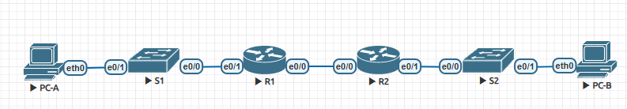

# Лабораторная работа №3.1. Настройка DHCPv4
## Топология

## Таблица адресации
Device | Interface | IP Address | Subnet Mask | Default Gateway
--- | --- | --- | --- | ---
R1 | G0/0/0 | 10.0.0.1 | 255.255.255.252 | N/A
 | | G0/0/1 |	N/A | N/A |	N/A
 | | G0/0/1.100 | | |			
 | | G0/0/1.1000 | N/A |N/A | N/A
R2 | G0/0/0 |	10.0.0.2 | 255.255.255.252 | N/A
 | | G0/0/1 | | N/A	|
S1 | VLAN 200 | | |	
S2 | VLAN 1 | | |
PC-A | NIC | DHCP |	DHCP | DHCP
PC-B | NIC | DHCP |	DHCP | DHCP
## Таблица Vlan
VLAN | Name | Interface Assigned
--- | --- | --- 
1 | N/A | S2: E0/1
100 | Clients |	S1: E0/1
200 | Management | S1: VLAN 200
999 | Parking_Lot |	S1: E0/2-3
1000 | Native |	N/A
## Цели.
Часть 1. Создание сети и базовая конфигурация устройств. 
Часть 2. Конфигурация и проверка 2 Dhcp серверов на R1
Часть.3 Конфигурация и проверка Dhcp Relay на R2
## Решение.
Файл с лабораторной работой в [файлах]() 
## Часть 1. Создание сети и базовая настройка оборудования.
### Шаг1. Разработайте схему адресации.
**Условия:**
Subnet the network 192.168.1.0/24 to meet the following requirements:
a.	One subnet, “Subnet A”, supporting 58 hosts (the client VLAN at R1).
b.	One subnet, “Subnet B”, supporting 28 hosts (the management VLAN at R1). 
c.	One subnet, “Subnet C”, supporting 12 hosts (the client network at R2).
### Таблица адресации.
Device | Interface | IP Address | Subnet Mask | Default Gateway
--- | --- | --- | --- | ---
R1 | G0/0/0 | 10.0.0.1 | 255.255.255.252 | N/A
| | G0/0/1 | N/A | N/A |	N/A
| | G0/0/1.100 | 192.168.1.1 |	255.255.255.192	
| | G0/0/1.200 | 192.168.1.65 |	255.255.255.224	
| | G0/0/1.1000 | N/A |	N/A | N/A
R2 | G0/0/0 | 10.0.0.2 | 255.255.255.252 | N/A
| | G0/0/1 | 192.168.1.97 |	255.255.255.240	
S1 | VLAN 200 |	192.168.1.66 | 255.255.255.224 | 192.168.1.65
S2 | VLAN 1 | 192.168.1.98 | 255.255.255.240 | 192.168.1.97
PC-A | NIC | DHCP |	DHCP |	DHCP
PC-B |	NIC |	DHCP |	DHCP |	DHCP
### Шаг 2. Постройте сеть согласно топологии.
Построил сеть в лабораторной среде
### Шаг 3. Выполните базовую настройку роутеров.
```
enable
conf t
hostname R1
no ip domain-lookup
password class
line console 0
password cisco
login
exit
line vty 0 15
password cisco
login
exit
service password-encryption
banner motd #Unauthorized access to this device is prohibited!#
copy running-config startup-config 
clock set
```
### Шаг 4. Настройте inter-VLAN Routing на R1
```
a. Activated interface G0/0/1 on the router.

    R1(config)#interface e0/1
    R1(config-if)#no shutdown 

b. Configured sub-interfaces for each VLAN as required by the IP addressing table. All sub-interfaces use 802.1Q encapsulation and are assigned the first usable address from the IP address pool you have calculated. Ensure the sub-interface for the native VLAN does not have an IP address assigned. Include a description for each sub-interface.

    R1(config-if)#int e0/1.100
    R1(config-subif)#encapsulation dot1Q 100
    R1(config-subif)#ip address 192.168.1.1 255.255.255.192
    R1(config-subif)#description Clients
    R1(config-subif)#int e0/1.200
    R1(config-subif)#encapsulation dot1Q 200
    R1(config-subif)#description Management
    R1(config-subif)#ip address 192.168.1.65 255.255.255.224
    R1(config-subif)#int e0/1.1000
    R1(config-subif)#encapsulation dot1Q 1000 native 
    R1(config-subif)#description Native_VLAN
```
### Шаг 5. Настройте G0/0/1 на R2. Затем G0/0/0 и статическую маршрутизацию на обоих роутерах.
```
a. Configured G0/0/1 on R2 with the first IP address of Subnet C you calculated earlier.

    R2(config)#int e0/1
    R2(config-if)#no shutdown 
    R2(config-if)#ip address 192.168.1.97 255.255.255.240

b. Configured interface G0/0/0 for each router based on the IP Addressing table above.

    R1(config)#interface e0/0
    R1(config-if)#no shutdown 
    R1(config-if)#ip address 10.0.0.1 255.255.255.252


    R2(config)#interface e0/0
    R2(config-if)#no shutdown 
    R2(config-if)#ip address 10.0.0.2 255.255.255.252

c. Configured a default route on each router pointed to the IP address of G0/0/0 on the other router.

    R1(config)#ip route 0.0.0.0 0.0.0.0 10.0.0.2

and

    R2(config)#ip route 0.0.0.0 0.0.0.0 10.0.0.1

d. Verified static routing is working by pinging R2's G0/0/1 address from R1.

R1# ping 192.168.1.97
Type escape sequence to abort.
Sending 5, 100-byte ICMP Echos to 192.168.1.97, timeout is 2 seconds:
!!!!!
Success rate is 100 percent (5/5), round-trip min/avg/max = 1/1/1 ms


e. Saved the running configuration to the startup configuration file.
```
### Шаг 6. Настройте базовую конфигрурацию на обоих свитчах.
```
Switch(config)#line console 0
Switch(config-line)#logging synchronous
Switch(config-line)#password cisco
Switch(config-line)#login
Switch(config-line)#exit
Switch(config)#no ip domain-lookup
Switch(config)#hostname SW-1
SW-1(config)#enable secret class
SW-1(config)#service password-encryption
SW-1(config)#line vty 0 4
SW-1(config-line)#password cisco
SW-1(config-line)#login
SW-1(config-line)#end
```
### Шаг 7. Создайте Vlan на S1.
```
a. Created and named the necessary VLANs on switch 1 from the table above.

    SW-1(config)#vlan 100
    SW-1(config-vlan)#name Clients
    SW-1(config-vlan)#vlan 200
    SW-1(config-vlan)#name Management
    SW-1(config-vlan)#vlan 999
    SW-1(config-vlan)#name Parking_Lot
    SW-1(config-vlan)#vlan 1000
    SW-1(config-vlan)#name Native

b. Configured and activated the management interface on S1 (VLAN 200) using the second IP address from the subnet calculated earlier. 

    SW-1(config)#interface vlan 200
    %LINK-5-CHANGED: Interface Vlan200, changed state to up
    SW-1(config-if)#ip address 192.168.1.66 255.255.255.224
    SW-1(config-if)#exit

Additionally, set the default gateway on S1.

    SW-1(config)#ip default-gateway 192.168.1.65

c.  Configure and activate the management interface on S2 (VLAN 1) using the second IP address from the subnet calculated earlier. 

    SW-2(config)#interface vlan 1
    SW-2(config-if)#ip address 192.168.1.98 255.255.255.240
    SW-2(config-if)#no shutdown 
        %LINEPROTO-5-UPDOWN: Line protocol on Interface Vlan1, changed state to up

Additionally, set the default gateway on S2

    SW-2(config)#ip default-gateway 192.168.1.97

d. Assigned all unused ports on **S1** to the **Parking_Lot** VLAN, configured them for static access mode, and administratively deactivated them. 

    SW-1(config)#int range e0/2-3
    SW-1(config-if-range)#sw mo access 
    SW-1(config-if-range)#sw ac vl 999
    SW-1(config-if-range)#shutdown 

On S2, administratively deactivated all the unused ports.

    SW-2(config)#interface range e0/2-3
    SW-2(config-if-range)#shutdown

```
### Шаг 8. Назначьте Влан правильным интерфейсам
```
SW-1(config)#interface e0/1
SW-1(config-if)#sw mo access 
SW-1(config-if)#sw ac vl 100

SW-2(config)#int e 0/1
SW-2(config-if)#sw mo access 
SW-2(config-if)#sw ac vl 1
```
**Why is interface F0/5 listed under VLAN 1?**
Потому что vlan1 по умолчанию дефолтный Vlan

### Шаг 9. Вручную настройте S1 интерфейс F0/5 (e0/0) как 802.1Q транк.
```
a. Changed the switchport mode on the interface to force trunking.

    SW-1(config-if)#switchport trunk encapsulation dot1q

b.  As a part of the trunk configuration, set the native VLAN to 1000.

        SW-1(config-if)#sw tr nat vlan 1000

c.  As another part of trunk configuration, specify that VLANs 100, 200, and 1000 are allowed to cross the trunk.

    SW-1(config-if)#sw tr allowed vlan 100,200,1000

d. Save the running configuration to the startup configuration file.
e. Verify trunking status.

Name: Et0/0
Switchport: Enabled
Administrative Mode: trunk
Operational Mode: trunk
Administrative Trunking Encapsulation: dot1q
Operational Trunking Encapsulation: dot1q
Negotiation of Trunking: On
Access Mode VLAN: 1 (default)
Trunking Native Mode VLAN: 1000 (Native)
Administrative Native VLAN tagging: enabled
Voice VLAN: none
Administrative private-vlan host-association: none
Administrative private-vlan mapping: none
Administrative private-vlan trunk native VLAN: none
Administrative private-vlan trunk Native VLAN tagging: enabled
Administrative private-vlan trunk encapsulation: dot1q
Administrative private-vlan trunk normal VLANs: none
Administrative private-vlan trunk associations: none
Administrative private-vlan trunk mappings: none
Operational private-vlan: none
Trunking VLANs Enabled: 100,200,1000
Pruning VLANs Enabled: 2-1001
Capture Mode Disabled
Protected: false
Appliance trust: none
```
**At this point, what IP address would the PC’s have if they were connected to the network using DHCP?**
Компьютер бы сам назначил себе адрес вида 169.254.xxx.xxx, так как DHCP еще не настроен.

## Часть 2. Настройка и проверка 2 DHCPv4 серверов на R1
### Шаг 1. Настройка R1 c DHCPv4 пулами для 2 поддерживаемых подсетей.
```
R1(config)#ip dhcp excluded-address 192.168.1.1 192.168.1.5
R1(config)#ip dhcp excluded-address 192.168.1.97 192.168.1.101
R1(config)#ip dhcp excluded-address 192.168.1.65 192.168.1.70
R1(config)#ip dhcp pool Subnet_A
R1(dhcp-config)#network 192.168.1.0 255.255.255.192
R1(dhcp-config)#domain-name CCN-lab.com
R1(dhcp-config)#default-router 192.168.1.1
R1(dhcp-config)#lease 2 12 30
R1(dhcp-config)#exit
R1(config)#ip dhcp pool R2_Client_LAN
R1(dhcp-config)#network 192.168.1.96 255.255.255.240
R1(dhcp-config)#domain-name CCN-lab.com
R1(dhcp-config)#default-router 192.168.1.97
R1(dhcp-config)#exit
```
### Шаг 2. Сохраните вашу настройку.
Сохранил
### Шаг 3. Проверьте настройку DHCPv4 сервера.
```
a. Issued the command **show ip dhcp pool** to examine the pool details.

R1#sh ip dhcp pool

Pool Subnet_A :
 Utilization mark (high/low)    : 100 / 0
 Subnet size (first/next)       : 0 / 0
 Total addresses                : 62
 Leased addresses               : 0
 Pending event                  : none
 1 subnet is currently in the pool :
 Current index        IP address range                    Leased addresses
 192.168.1.1          192.168.1.1      - 192.168.1.62      0

Pool R2_Client_LAN :
 Utilization mark (high/low)    : 100 / 0
 Subnet size (first/next)       : 0 / 0
 Total addresses                : 14
 Leased addresses               : 0
 Pending event                  : none
 1 subnet is currently in the pool :
 Current index        IP address range                    Leased addresses
 192.168.1.97         192.168.1.97     - 192.168.1.110     0

b. Issued the command **show ip dhcp bindings** to examine established DHCP address assignments.

R1#sh ip dhcp binding
Bindings from all pools not associated with VRF:
IP address          Client-ID/              Lease expiration        Type
                    Hardware address/
                    User name


c. Issue the command show ip dhcp server statistics to examine DHCP messages.
R1#show ip dhcp server statistics
Memory usage         25218
Address pools        2
Database agents      0
Automatic bindings   0
Manual bindings      0
Expired bindings     0
Malformed messages   0
Secure arp entries   0

Message              Received
BOOTREQUEST          0
DHCPDISCOVER         0
DHCPREQUEST          0
DHCPDECLINE          0
DHCPRELEASE          0
DHCPINFORM           0

Message              Sent
BOOTREPLY            0
DHCPOFFER            0
DHCPACK              0
DHCPNAK              0
```
### Шаг4. Получите ip адрес по DHCP на PC-A
```
VPCS> dhcp -r
DDORA IP 192.168.1.6/26 GW 192.168.1.1


VPCS> show ip

NAME        : VPCS[1]
IP/MASK     : 192.168.1.6/26
GATEWAY     : 192.168.1.1
DNS         :
DHCP SERVER : 192.168.1.1
DHCP LEASE  : 217276, 217800/108900/190575
DOMAIN NAME : CCN-lab.com
MAC         : 00:50:79:66:68:01
LPORT       : 20000
RHOST:PORT  : 127.0.0.1:30000
MTU         : 1500


VPCS> ping 192.168.1.1

84 bytes from 192.168.1.1 icmp_seq=1 ttl=255 time=1.013 ms
84 bytes from 192.168.1.1 icmp_seq=2 ttl=255 time=1.135 ms
84 bytes from 192.168.1.1 icmp_seq=3 ttl=255 time=1.438 ms
84 bytes from 192.168.1.1 icmp_seq=4 ttl=255 time=1.644 ms
84 bytes from 192.168.1.1 icmp_seq=5 ttl=255 time=1.456 ms
```
## Часть 4. Настройте и проверьте DHCP Relay на R2
### Шаг 1. Натройте R2 как DHCP Relay agent для Lan на G0/0/1
```
a. Configured the **ip helper-address** command on G0/0/1 specifying R1’s G0/0/0 IP address. and saved my configuration.

    R2(config)#interface e0/1
    R2(config-if)#ip helper
    R2(config-if)#ip helper-address 10.0.0.1
    R2(config)#end
    R2#write
    Building configuration...
    [OK]
```
### Шаг 2. Получите ip адрес по DHCP на PC-B
```
a. Open a command prompt on PC-B and issue the command **ipconfig /renew**.
VPCS> dhcp -r
DDORA IP 192.168.1.102/28 GW 192.168.1.97

b. Once the renewal process is complete, issue the command **ipconfig** to view the new IP information.

VPCS> show ip

NAME        : VPCS[1]
IP/MASK     : 192.168.1.102/28
GATEWAY     : 192.168.1.97
DNS         :
DHCP SERVER : 10.0.0.1
DHCP LEASE  : 86283, 86400/43200/75600
DOMAIN NAME : CCN-lab.com
MAC         : 00:50:79:66:68:02
LPORT       : 20000
RHOST:PORT  : 127.0.0.1:30000
MTU         : 1500

c. Tested connectivity by pinging **R1’s** **G0/0/1** interface IP address.


VPCS> ping 192.168.1.97

84 bytes from 192.168.1.97 icmp_seq=1 ttl=255 time=1.090 ms
84 bytes from 192.168.1.97 icmp_seq=2 ttl=255 time=1.440 ms
84 bytes from 192.168.1.97 icmp_seq=3 ttl=255 time=1.283 ms
84 bytes from 192.168.1.97 icmp_seq=4 ttl=255 time=0.893 ms
84 bytes from 192.168.1.97 icmp_seq=5 ttl=255 time=1.408 ms


d. Issued the **show ip dhcp binding** on R1 to verify DHCP bindings.

R1#show ip dhcp binding
Bindings from all pools not associated with VRF:
IP address          Client-ID/              Lease expiration        Type
                    Hardware address/
                    User name
192.168.1.6         0100.5079.6668.01       Apr 20 2025 01:50 AM    Automatic
192.168.1.102       0100.5079.6668.02       Apr 18 2025 01:25 PM    Automatic

e. Issue the show ip dhcp server statistics on R1 and R2 to verify DHCP messages.
R1#show ip dhcp server statistic
Memory usage         42136
Address pools        2
Database agents      0
Automatic bindings   2
Manual bindings      0
Expired bindings     0
Malformed messages   0
Secure arp entries   0

Message              Received
BOOTREQUEST          0
DHCPDISCOVER         4
DHCPREQUEST          2
DHCPDECLINE          0
DHCPRELEASE          0
DHCPINFORM           0

Message              Sent
BOOTREPLY            0
DHCPOFFER            2
DHCPACK              2
DHCPNAK              0


R2>show ip dhcp server statistic
Memory usage         22565
Address pools        0
Database agents      0
Automatic bindings   0
Manual bindings      0
Expired bindings     0
Malformed messages   0
Secure arp entries   0

Message              Received
BOOTREQUEST          0
DHCPDISCOVER         0
DHCPREQUEST          0
DHCPDECLINE          0
DHCPRELEASE          0
DHCPINFORM           0

Message              Sent
BOOTREPLY            0
DHCPOFFER            0
DHCPACK              0
DHCPNAK              0

```