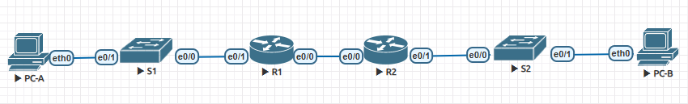

# Лабораторная работа №3.12. Настройка DHCPv4
## Топология

## Таблица адресации.
Device | Interface | IP Address 
--- | --- | --- 
R1 | G0/0/0 | 2001:db8:acad:2::1/64
| | | fe80::1
| | G0/0/1 | 2001:db8:acad:1::1/64
| | | fe80::1
R2 | G0/0/0 | 2001:db8:acad:2::2/64
| | | fe80::2
| | G0/0/1 | 2001:db8:acad:3::1/64
| | | fe80::1
PC-A | NIC | DHCP
PC-B | NIC | DHCP
## Цели.
Часть 1: Создание сети и настройка основных параметров устройства
Часть 2: Проверка назначения адреса SLAAC от R1
Часть 3: Настройка и проверка Stateless DHCPv6 Server на R1
Часть 4: Настройка и проверка Stateful DHCPv6 Server  на R1
Часть 5: Настройка и проверка DHCPv6 Relay  на R2
## Решение.
Файл с лабораторной работой в [файлах]()
## Часть 1: Создание сети и настройка основных параметров устройства
### Шаг1. Создание сети согласно топологии
См. рисунок выше
### Шаг 2. Конфигурация базовых настроек свитчей.
```
line console 0 
logging synchronous 
password cisco
login
exit
no ip domain-lookup
hostname SW-2
enable secret class
service password-encryption
line vty 0 4 
password cisco
login
end
clock set 13:09:00 18 Apr 2025
copy run start
```
### Шаг 3. Конфигурация базовых настроек роутеров.
```
line console 0 
logging synchronous 
password cisco
login
exit
no ip domain-lookup
hostname R1
enable secret class
service password-encryption
line vty 0 4 
password cisco
login
ipv6 unicast-routing
end
clock set 23:43:00 17 Apr 2025
copy run start
```
### Конфигурация интерфейсов и маршрутизации на роутерах
```
a. Configured the G0/0/0 and G0/0/1 interfaces on R1 and R2 with the IPv6 addresses specified in the table above.
    
    R1(config)#interface g0/0/0
    R1(config-if)#ipv6 address 2001:db8:acad:2::1/64
    R1(config-if)#ipv6 address fe80::1 link-local 
    R1(config)#interface g0/0/1
    R1(config-if)#ipv6 address 2001:db8:acad:1::1/64
    R1(config-if)#ipv6 address fe80::1 link-local

b. Configured a default route on each router pointed to the IP address of G0/0/0 on the other router.

    R1(config)#ipv6 route ::1/64 2001:db8:acad:2::2
    R2(config)#ipv6 route ::1/64 2001:db8:acad:2::1

c. Verified routing is working by pinging R2’s G0/0/1 address from R1

 R1#ping 2001:db8:acad:3::1
Type escape sequence to abort.
Sending 5, 100-byte ICMP Echos to 2001:DB8:ACAD:3::1, timeout is 2 seconds:
!!!!!
Success rate is 100 percent (5/5), round-trip min/avg/max = 1/4/18 ms

d. Saved the running configuration to the startup configuration file.
```
Часть 2: Проверка назначения адреса SLAAC от R1
```
VPCS> show ipv6

NAME              : VPCS[1]
LINK-LOCAL SCOPE  : fe80::250:79ff:fe66:6805/64
GLOBAL SCOPE      : 2001:db8:acad:1:2050:79ff:fe66:6805/64
DNS               :
ROUTER LINK-LAYER : aa:bb:cc:00:10:10
MAC               : 00:50:79:66:68:05
LPORT             : 20000
RHOST:PORT        : 127.0.0.1:30000
MTU:              : 1500
```
**Откуда взялась часть host-id адреса?** 
Взяв ответ от R1 с использованием SLAAC
## Часть 3: Настройка и проверка Stateless DHCPv6 Server на R1
### Шаг 1: Более подробно изучите конфигурацию ПК-А.
См выше, на vps не команды ipconfig /all
### Шаг 2: Настройте R1 для предоставления stateless DHCPv6 для ПК-A
```
R1(config)#ipv6 dhcp pool R1-STATELESS
R1(config-dhcpv6)#dns-server 2001:db8:acad::254
R1(config-dhcpv6)#domain-name STATELESS.com
R1(config-dhcpv6)#interface e0/0
R1(config-if)#ipv6 nd other-config-flag
R1(config-if)#ipv6 dhcp server R1-STATELESS
```
Проверьте вывод команды ipconfig /all
К сожалению не увидел на vpc поддержку dhcpv6

Проверьте подключение, отправив ping-запрос на IP-адрес интерфейса G0/0/1 (e0/1) маршрутизатора R2.
```
VPCS> ping 2001:db8:acad:3::1

2001:db8:acad:3::1 icmp6_seq=1 ttl=63 time=11.207 ms
2001:db8:acad:3::1 icmp6_seq=2 ttl=63 time=1.587 ms
2001:db8:acad:3::1 icmp6_seq=3 ttl=63 time=1.355 ms
```
### Часть 4: Настройка и проверка Stateful DHCPv6 Server  на R1
```
R1(config)# ipv6 dhcp pool R2-STATEFUL
R1(config-dhcp)# address prefix 2001:db8:acad:3:aaa::/80
R1(config-dhcp)# dns-server 2001:db8:acad::254
R1(config-dhcp)# domain-name STATEFUL.com

R1(config)# interface g0/0/0
R1(config-if)# ipv6 dhcp server R2-STATEFUL
```    
## Часть 5: Настройка и проверка DHCPv6 Relay  на R2
### Шаг 1: Включите PC-B и проверьте сгенерированный им адрес SLAAC.
```
VPCS> show ipv6

NAME              : VPCS[1]
LINK-LOCAL SCOPE  : fe80::250:79ff:fe66:6806/64
GLOBAL SCOPE      : 2001:db8:acad:3:2050:79ff:fe66:6806/64
DNS               :
ROUTER LINK-LAYER : aa:bb:cc:00:20:10
MAC               : 00:50:79:66:68:06
LPORT             : 20000
RHOST:PORT        : 127.0.0.1:30000
MTU:              : 1500
```
### Шаг 2: Настройте R2 как DHCP relay agent для локальной сети на G0/0/1.
```
R2(config)# interface g0/0/1
R2(config-if)# ipv6 nd managed-config-flag
R2(config-if)# ipv6 dhcp relay destination 2001:db8:acad:2::1 g0/0/0

```
### Шаг 3: Попытайтесь получить адрес IPv6 от DHCPv6 на PC-B.
К сожалению не нашел поддержки dhcpv6 в VPS

Проверьте подключение, отправив ping-запрос на IP-адрес интерфейса G0/0/1 маршрутизатора R1.
```
VPCS>  ping 2001:db8:acad:1::1

2001:db8:acad:1::1 icmp6_seq=1 ttl=63 time=11.254 ms
2001:db8:acad:1::1 icmp6_seq=2 ttl=63 time=1.276 ms
2001:db8:acad:1::1 icmp6_seq=3 ttl=63 time=1.250 ms
2001:db8:acad:1::1 icmp6_seq=4 ttl=63 time=1.856 ms
2001:db8:acad:1::1 icmp6_seq=5 ttl=63 time=1.750 ms
```

