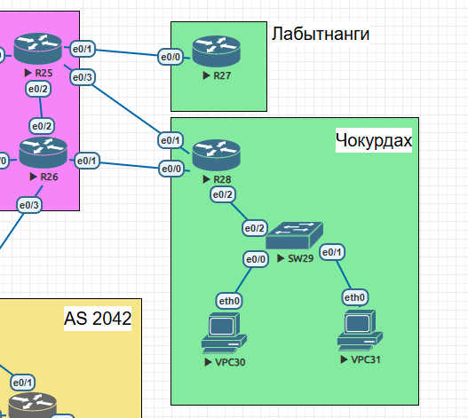

# Лабораторная работа №5. Настройка политики маршрутизации в офисе Чокурдах.
## Топология

## Задание
1. Настроить политику маршрутизации для сетей офиса.
2. Распределить трафик между двумя линками с провайдером.
3. Настроить отслеживание линка через технологию IP SLA.(только для IPv4).
4. Настройть для офиса Лабытнанги маршрут по-умолчанию.
5. План работы и изменения зафиксированы в документации.

## Решение
Пингуем интерфейc e0/1 R26 раз в секунду. Если пинга нет, переключаем на R25 e0/3

Настройка политики маршрутизации и отслеживание линка через технологию IP SLA
```
ip sla 1
 icmp-echo 17.16.31.3 source-interface Loopback1
 tos 46
 threshold 1000
 timeout 1000
 frequency 1
ip sla schedule 1 life forever start-time now

route-map SLA permit 10
 description SLA
 match ip address SLA
 set ip next-hop 10.0.0.19

ip access-list extended SLA
 permit icmp host 172.16.41.1 host 172.16.31.3

ip local policy route-map SLA

track 1 ip sla 1 reachability
 delay down 10 up 10

```
## Конфигурация оборудования Чокурдах
R28
```
R28#show running-config
Building configuration...

Current configuration : 1939 bytes
!
! Last configuration change at 19:02:14 UTC Fri May 9 2025
!
version 15.4
service timestamps debug datetime msec
service timestamps log datetime msec
service password-encryption
!
hostname R28
!
boot-start-marker
boot-end-marker
!
!
enable secret 5 $1$1boT$4FejUacu4HeQUc/SKNuxu1
!
no aaa new-model
mmi polling-interval 60
no mmi auto-configure
no mmi pvc
mmi snmp-timeout 180
!
!
!
!
!
!
!
!


!
!
!
!
no ip domain lookup
ip cef
no ipv6 cef
!
multilink bundle-name authenticated
!
!
!
!
!
!
!
!
!
redundancy
!
!
track 1 ip sla 1 reachability
 delay down 10 up 10
!
!
!
!
!
!
!
!
!
!
!
!
!
!
interface Loopback1
 ip address 172.16.41.1 255.255.255.255
!
interface Ethernet0/0
 ip address 10.0.0.20 255.255.255.0
!
interface Ethernet0/1
 ip address 10.0.1.18 255.255.255.0
!
interface Ethernet0/2
 no ip address
!
interface Ethernet0/2.40
 encapsulation dot1Q 40
 ip address 172.16.40.1 255.255.255.240
!
interface Ethernet0/2.41
 encapsulation dot1Q 41
 ip address 172.16.40.17 255.255.255.240
!
interface Ethernet0/3
 no ip address
 shutdown
!
interface Ethernet1/0
 no ip address
 shutdown
!
interface Ethernet1/1
 no ip address
 shutdown
!
interface Ethernet1/2
 no ip address
 shutdown
!
interface Ethernet1/3
 no ip address
 shutdown
!
ip local policy route-map SLA
ip forward-protocol nd
!
!
no ip http server
no ip http secure-server
ip route 0.0.0.0 0.0.0.0 10.0.0.19 track 1
ip route 0.0.0.0 0.0.0.0 10.0.1.17 100
!
ip access-list extended SLA
 permit icmp host 172.16.41.1 host 172.16.31.3
!
ip sla 1
 icmp-echo 17.16.31.3 source-interface Loopback1
 tos 46
 threshold 1000
 timeout 1000
 frequency 1
ip sla schedule 1 life forever start-time now
!
route-map SLA permit 10
 description SLA
 match ip address SLA
 set ip next-hop 10.0.0.19
!
!
!
control-plane

R28#p local policy route-map SLA
Translating "local"

ping local policy route-map SLA
           ^
% Invalid input detected at '^' marker.

R28#show run
R28#show running-config
Building configuration...

Current configuration : 1939 bytes
!
! Last configuration change at 19:02:14 UTC Fri May 9 2025
!
version 15.4
service timestamps debug datetime msec
service timestamps log datetime msec
service password-encryption
!
hostname R28
!
boot-start-marker
boot-end-marker
!
!
enable secret 5 $1$1boT$4FejUacu4HeQUc/SKNuxu1
!
no aaa new-model
mmi polling-interval 60
no mmi auto-configure
no mmi pvc
mmi snmp-timeout 180
!
!
!
!
!
!
!
!


!
!
!
!
no ip domain lookup
ip cef
no ipv6 cef
!
multilink bundle-name authenticated
!
!
!
!
!
!
!
!
!
redundancy
!
!
track 1 ip sla 1 reachability
 delay down 10 up 10
!
!
!
!
!
!
!
!
!
!
!
!
!
!
interface Loopback1
 ip address 172.16.41.1 255.255.255.255
!
interface Ethernet0/0
 ip address 10.0.0.20 255.255.255.0
!
interface Ethernet0/1
 ip address 10.0.1.18 255.255.255.0
!
interface Ethernet0/2
 no ip address
!
interface Ethernet0/2.40
 encapsulation dot1Q 40
 ip address 172.16.40.1 255.255.255.240
!
interface Ethernet0/2.41
 encapsulation dot1Q 41
 ip address 172.16.40.17 255.255.255.240
!
interface Ethernet0/3
 no ip address
 shutdown
!
interface Ethernet1/0
 no ip address
 shutdown
!
interface Ethernet1/1
 no ip address
 shutdown
!
interface Ethernet1/2
 no ip address
 shutdown
!
interface Ethernet1/3
 no ip address
 shutdown
!
ip local policy route-map SLA
ip forward-protocol nd
!
!
no ip http server
no ip http secure-server
ip route 0.0.0.0 0.0.0.0 10.0.0.19 track 1
ip route 0.0.0.0 0.0.0.0 10.0.1.17 100
!
ip access-list extended SLA
 permit icmp host 172.16.41.1 host 172.16.31.3
!
ip sla 1
 icmp-echo 17.16.31.3 source-interface Loopback1
 tos 46
 threshold 1000
 timeout 1000
 frequency 1
ip sla schedule 1 life forever start-time now
!
route-map SLA permit 10
 description SLA
 match ip address SLA
 set ip next-hop 10.0.0.19
!
!
!
control-plane
!
!
!
!
!
!
!
!
line con 0
 password 7 14141B180F0B
 logging synchronous
 login
line aux 0
line vty 0 4
 password 7 110A1016141D
 login
 transport input none
!
!
end
```
SW29
```
SW29#show running-config
Building configuration...

Current configuration : 1163 bytes
!
! Last configuration change at 20:33:50 UTC Fri May 9 2025
!
version 15.2
service timestamps debug datetime msec
service timestamps log datetime msec
service password-encryption
service compress-config
!
hostname SW29
!
boot-start-marker
boot-end-marker
!
!
enable secret 5 $1$ziY9$jX4xJ0CX.lHA1SyY7i2g2/
!
no aaa new-model
!
!
!
!
!
!
!
!
no ip domain-lookup
ip cef
no ipv6 cef
!
!
spanning-tree mode pvst
spanning-tree extend system-id
!
vlan internal allocation policy ascending
!
!
!
!
!
!
!
!
!
!
!
!
!
interface Ethernet0/0
 switchport access vlan 40
 switchport mode access
!
interface Ethernet0/1
 switchport access vlan 41
 switchport mode access
!
interface Ethernet0/2
 switchport trunk encapsulation dot1q
 switchport mode trunk
!
interface Ethernet0/3
!
interface Vlan40
 ip address 172.16.40.3 255.255.255.240
!
interface Vlan41
 ip address 172.16.40.19 255.255.255.240
 shutdown
!
ip forward-protocol nd
!
no ip http server
no ip http secure-server
!
ip route 0.0.0.0 0.0.0.0 172.16.40.1
!
!
!
!
!
control-plane
!
!
line con 0
 password 7 14141B180F0B
 logging synchronous
 login
line aux 0
line vty 0 4
 password 7 070C285F4D06
 login
!
!
end
```
R25
```
R25#show running-config
Building configuration...

Current configuration : 1357 bytes
!
! Last configuration change at 21:01:53 UTC Fri May 9 2025
!
version 15.4
service timestamps debug datetime msec
service timestamps log datetime msec
service password-encryption
!
hostname R25
!
boot-start-marker
boot-end-marker
!
!
enable secret 5 $1$VCBz$o4JY3tC8N04BKXf9Ow4cr.
!
no aaa new-model
mmi polling-interval 60
no mmi auto-configure
no mmi pvc
mmi snmp-timeout 180
!
!
!
!
!
!
!
!


!
!
!
!
no ip domain lookup
ip cef
no ipv6 cef
!
multilink bundle-name authenticated
!
!
!
!
!
!
!
!
!
redundancy
!
!
!
!
!
!
!
!
!
!
!
!
!
!
!
interface Loopback1
 ip address 172.16.31.3 255.255.255.255
!
interface Ethernet0/0
 no ip address
 shutdown
!
interface Ethernet0/1
 ip address 10.0.0.15 255.255.255.0
!
interface Ethernet0/2
 no ip address
!
interface Ethernet0/3
 ip address 10.0.1.17 255.255.255.0
!
interface Ethernet1/0
 no ip address
 shutdown
!
interface Ethernet1/1
 no ip address
 shutdown
!
interface Ethernet1/2
 no ip address
 shutdown
!
interface Ethernet1/3
 no ip address
 shutdown
!
ip forward-protocol nd
!
!
no ip http server
no ip http secure-server
ip route 172.16.40.0 255.255.255.0 10.0.0.20
ip route 172.16.70.0 255.255.255.0 10.0.0.16
!
!
!
!
control-plane
!
!
!
!
!
!
!
!
line con 0
 password 7 02050D480809
 logging synchronous
 login
line aux 0
line vty 0 4
 password 7 094F471A1A0A
 login
 transport input none
!
!
end

```

R26
```
R26#show running-config
Building configuration...

Current configuration : 1319 bytes
!
! Last configuration change at 21:09:20 UTC Fri May 9 2025
!
version 15.4
service timestamps debug datetime msec
service timestamps log datetime msec
service password-encryption
!
hostname R26
!
boot-start-marker
boot-end-marker
!
!
enable secret 5 $1$F0VW$iiyIaVT2k5wQNYI0KkznZ/
!
no aaa new-model
mmi polling-interval 60
no mmi auto-configure
no mmi pvc
mmi snmp-timeout 180
!
!
!
!
!
!
!
!


!
!
!
!
no ip domain lookup
ip cef
no ipv6 cef
!
multilink bundle-name authenticated
!
!
!
!
!
!
!
!
!
redundancy
!
!
!
!
!
!
!
!
!
!
!
!
!
!
!
interface Loopback1
 ip address 172.16.31.4 255.255.255.0
!
interface Ethernet0/0
 no ip address
 shutdown
!
interface Ethernet0/1
 ip address 10.0.0.19 255.255.255.0
 shutdown
!
interface Ethernet0/2
 no ip address
 shutdown
!
interface Ethernet0/3
 no ip address
 shutdown
!
interface Ethernet1/0
 no ip address
 shutdown
!
interface Ethernet1/1
 no ip address
 shutdown
!
interface Ethernet1/2
 no ip address
 shutdown
!
interface Ethernet1/3
 no ip address
 shutdown
!
ip forward-protocol nd
!
!
no ip http server
no ip http secure-server
ip route 172.16.40.0 255.255.255.0 10.0.0.20
!
!
!
!
control-plane
!
!
!
!
!
!
!
!
line con 0
 password 7 070C285F4D06
 logging synchronous
 login
line aux 0
line vty 0 4
 password 7 13061E010803
 login
 transport input none
!
!
end

```

## Конфигурация оборудования Лабытнаги
R27
```
R27#show running-config
Building configuration...

Current configuration : 1301 bytes
!
! Last configuration change at 18:11:33 UTC Fri May 9 2025
!
version 15.4
service timestamps debug datetime msec
service timestamps log datetime msec
service password-encryption
!
hostname R27
!
boot-start-marker
boot-end-marker
!
!
enable secret 5 $1$fG3K$1Zd8LehxSkQZdlMWtg6F7/
!
no aaa new-model
mmi polling-interval 60
no mmi auto-configure
no mmi pvc
mmi snmp-timeout 180
!
!
!
!
!
!
!
!


!
!
!
!
no ip domain lookup
ip cef
no ipv6 cef
!
multilink bundle-name authenticated
!
!
!
!
!
!
!
!
!
redundancy
!
!
!
!
!
!
!
!
!
!
!
!
!
!
!
interface Loopback1
 ip address 172.16.70.1 255.255.255.255
!
interface Ethernet0/0
 ip address 10.0.0.16 255.255.255.0
!
interface Ethernet0/1
 no ip address
 shutdown
!
interface Ethernet0/2
 no ip address
 shutdown
!
interface Ethernet0/3
 no ip address
 shutdown
!
interface Ethernet1/0
 no ip address
 shutdown
!
interface Ethernet1/1
 no ip address
 shutdown
!
interface Ethernet1/2
 no ip address
 shutdown
!
interface Ethernet1/3
 no ip address
 shutdown
!
ip forward-protocol nd
!
!
no ip http server
no ip http secure-server
ip route 0.0.0.0 0.0.0.0 10.0.0.15
!
!
!
!
control-plane
!
!
!
!
!
!
!
!
line con 0
 password 7 1511021F0725
 logging synchronous
 login
line aux 0
line vty 0 4
 password 7 104D000A0618
 login
 transport input none
!
!
end
```